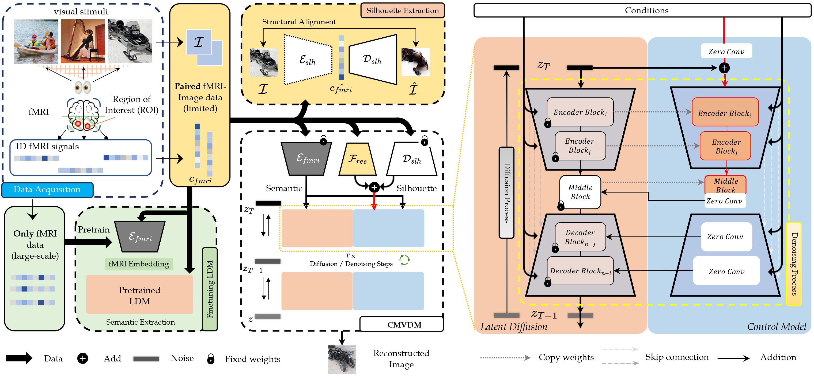

# Controllable Mind Visual Diffusion Model


This paper has been accepted to AAAI 2024. [arxiv](https://arxiv.org/pdf/2305.10135.pdf)


## Abstract
Brain signal visualization has emerged as an active research area, serving as a critical interface between the human visual system and computer vision models. Although diffusion models have shown promise in analyzing functional magnetic resonance imaging (fMRI) data, including reconstructing high-quality images consistent with original visual stimuli, their accuracy in extracting semantic and silhouette information from brain signals remains limited. In this regard, we propose a novel approach, referred to as Controllable Mind Visual Diffusion Model (CMVDM). CMVDM extracts semantic and silhouette information from fMRI data using attribute alignment and assistant networks. Additionally, a residual block is incorporated to capture information beyond semantic and silhouette features. We then leverage a control model to fully exploit the extracted information for image synthesis, resulting in generated images that closely resemble the visual stimuli in terms of semantics and silhouette. Through extensive experimentation, we demonstrate that CMVDM outperforms existing state-of-the-art methods both qualitatively and quantitatively.

<!--  -->
<div style="text-align:center"></div>


## Overview
Our framework consists of two main stages:
- Stage A: Semantic training
- Stage B: Control Model Training

Following Mind-Vis, The **data** folder and **pretrains** folder are not included in this repository. Please download them from [FigShare](https://figshare.com/s/94cd778e6afafb00946e).

File path | Description
```

/data
┣  HCP
┃   ┣  npz
┃   ┃   ┣  dummy_sub_01
┃   ┃   ┃   ┗ HCP_visual_voxel.npz
┃   ┃   ┣  dummy_sub_02
┃   ┃   ┃   ┗ ...

┣  Kamitani
┃   ┣  npz
┃   ┃   ┗  sbj_1.npz
┃   ┃   ┗  sbj_2.npz
┃   ┃   ┗  sbj_3.npz
┃   ┃   ┗  sbj_4.npz
┃   ┃   ┗  sbj_5.npz
┃   ┃   ┗  images_256.npz
┃   ┃   ┗  imagenet_class_index.json
┃   ┃   ┗  imagenet_training_label.csv
┃   ┃   ┗  imagenet_testing_label.csv

┣  BOLD5000
┃   ┣  BOLD5000_GLMsingle_ROI_betas
┃   ┃   ┣  py
┃   ┃   ┃   ┗ CSI1_GLMbetas-TYPED-FITHRF-GLMDENOISE-RR_allses_LHEarlyVis.npy
┃   ┃   ┃   ┗ ...
┃   ┃   ┃   ┗ CSIx_GLMbetas-TYPED-FITHRF-GLMDENOISE-RR_allses_xx.npy
┃   ┣  BOLD5000_Stimuli
┃   ┃   ┣  Image_Labels
┃   ┃   ┣  Scene_Stimuli
┃   ┃   ┣  Stimuli_Presentation_Lists

```


## Environment setup
Create and activate conda environment named ```cmvdm``` from our ```env.yaml```
```sh
conda env create -f env.yaml
conda activate cmvdm
```

## Semantic Training (Stage A)
In this stage, the cross-attention heads and pre-trained fMRI encoder will be jointly optimized with fMRI-image pairs.

Run with custom-pre-trained fMRI encoder and parameters:
```sh
python code/stageB_ldm_finetune_clip.py --batch_size 24 --kam_path data/Kamitani/npz --bold5000_path data/BOLD5000 --dataset GOD --pretrain_mbm_path frmi_pretrains/GOD/fmri_encoder.pth --pretrain_gm_path frmi_pretrains/ldm/label2img --pretrain_finetune_path frmi_pretrains/GOD/finetuned.pth --config_root pretrains/ldm/label2img/controlnet_config.yaml
```


## Control Model Training (Stage B)
In this stage, the control model and the residual blocks will be training.

Run with custom-pre-trained fMRI encoder and parameters:
```sh
python code/stageB_ldm_finetune.py --batch_size 32 --kam_path data/Kamitani/npz --bold5000_path data/BOLD5000 --dataset GOD --pretrain_mbm_path frmi_pretrains/GOD/fmri_encoder.pth --pretrain_gm_path frmi_pretrains/ldm/label2img --pretrain_finetune_path frmi_pretrains/GOD/finetuned.pth --config_root pretrains/ldm/label2img/controlnet_config.yaml --checkpoint_path results/GOD/clip_generation/TIME/checkpoint_best.pth
```

The ```frmi_pretrains``` can be found in link [FigShare](https://figshare.com/s/94cd778e6afafb00946e).
